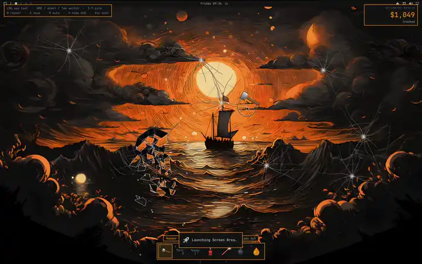

# Screen Breaker

Smash your Omarchy desktop. Screen Breaker takes a screenshot of the focused
monitor, turns it into glass, and hands you seven ways to destroy it. A remake
of the old [Screen Breaker XP](https://yardenz.itch.io/screen-breaker-xp),
built as a native Omarchy shell overlay.

[](media/demo.mp4)

[Watch the full 26-second demo](media/demo.mp4)

Nothing on your computer is harmed: you're breaking a picture of it. Press
`Esc` and you're back at work.

## Tools

| Key | Tool | What it does |
| --- | --- | --- |
| `1` | Hammer | Spider-web cracks. Hit the same spot again to knock the glass out. |
| `2` | Pistol | Bullet holes, muzzle flash, and brass casings. |
| `3` | SMG | Hold to spray. |
| `4` | Flamethrower | Hold to scorch the screen. Fires keep burning after you let go. |
| `5` | Laser | Hold and drag to cut glowing lines. |
| `6` | Bomb | Click to drop one, then stand back. |
| `7` | `sudo rm -rf` | Hold to melt the pixels. |

## Controls

- **Left click** uses the tool.
- **Right click**, the **mouse wheel**, or **Tab** switches tools; **1–7** picks one.
- **R** repairs the screen, **S** saves the wreckage to your screenshot folder
  (`$OMARCHY_SCREENSHOT_DIR`, else `~/Pictures`), **M** mutes, **H** hides the
  HUD, and **Esc** quits.

The HUD follows your Omarchy theme and keeps a running repair estimate.

## Requirements

- Omarchy with the Quickshell-based `omarchy-shell` (Omarchy Quattro).
- `grim` for the screenshot and `pw-play` (PipeWire) for sound. Both ship with
  Omarchy.

## Install

```bash
omarchy plugin add https://github.com/justwiebe/omarchy-screen-breaker --enable
```

Then start a game:

```bash
omarchy-shell shell summon io.github.justwiebe.screen-breaker '{}'
```

### Add a keybinding (optional)

In `~/.config/hypr/bindings.lua`:

```lua
o.bind("SUPER + SHIFT + B", "Screen Breaker", "omarchy-shell shell summon io.github.justwiebe.screen-breaker '{}'")
```

`SUPER + SHIFT + B` is an Omarchy default, so run `hl.unbind("SUPER + SHIFT + B")`
first or pick a free key.

### Add it to the Omarchy menu (optional)

In `~/.config/omarchy/extensions/omarchy-menu.jsonc`:

```jsonc
"trigger.screen-breaker": {"icon":"󰣪","label":"Screen Breaker","action":"omarchy-shell shell summon io.github.justwiebe.screen-breaker '{}'"},
```

The plugin never edits your configuration itself; both of these are up to you.

## Remove

```bash
omarchy plugin remove io.github.justwiebe.screen-breaker
```

If you added a keybinding or menu entry, delete those lines too.

## How it works

- `ScreenBreaker.qml` is the overlay: a fullscreen layer-shell window on the
  focused monitor, the tools, the frame loop, and the HUD.
- `DamageLayer.qml` draws cracks, holes, scorch, and dead pixels into 256 px
  canvas tiles, so a hit only repaints the tiles it touches.
- `Shard.qml` is a falling piece of glass: a polygon textured with the part of
  the screenshot it came from.
- `Drip.qml` is one melting column for `sudo rm -rf`.
- Fire, sparks, smoke, and glass dust are Qt Quick particles.
- `Sound.qml` plays effects with `pw-play`, since Qt Multimedia isn't part of a
  stock Omarchy install.

The screenshot is written to `$XDG_RUNTIME_DIR/screen-breaker.png` and
overwritten on every run. Nothing leaves your machine.

## Development

The sounds and sprites in `assets/` are generated with pure Python:

```bash
python3 tools/generate-assets.py
```

Validate the manifest with `omarchy plugin validate .`.

## License

MIT. See [LICENSE](LICENSE).
